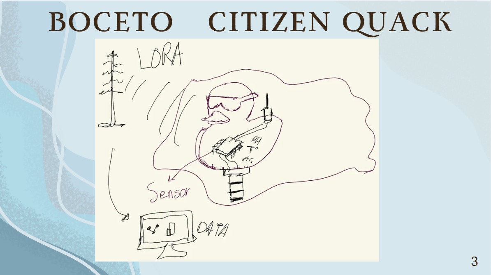

# Semana 1

## 1) Nivel de Madurez Tecnológica (TRL)

El **Technology Readiness Level (TRL)** es un sistema que clasifica el grado de desarrollo que presenta una tecnología en un momento específico.

Esta escala permite determinar si una idea tecnológica se encuentra en una fase conceptual, si ya puede probarse en laboratorio o si está lo suficientemente desarrollada para operar en condiciones reales y avanzar hacia su comercialización.

La escala TRL está compuesta por **9 niveles**, que van desde la investigación fundamental (**TRL1**) hasta la implementación completa de la tecnología en el mercado (**TRL9**).

## TRL1
Debemos realizar una investigación básica sobre nuestra idea, buscar artículos científicos publicados que respalden nuestra idea.

## TRL2
Búsqueda de patentes, investigar lo necesario para que realicemos el prototipo, buscar usuarios que se beneficiaran con esta idea, hacer el plan de licenciamiento.

## TRL3
Realizar pruebas experimentales, identificar los componentes para el bastón, investigación de los aspectos regulatorios.

## TRL4
Integración de los componentes principales, validación de mercado, funcionabilidad a nivel laboratorio, identificar riesgos tecnológicos, de mercado y financieros.

---

## 2) Syllabus

[Descargar especificación (PDF)](\rec\arch\syllabus.pdf)

<object data="..\rec\arch\syllabus.pdf" type="application/pdf" width="100%" height="600">
  
No se pudo mostrar el PDF. <a href="..\rec\arch\syllabus.pdf">Descargar</a>

</object>

---

## 3) Boceto

---