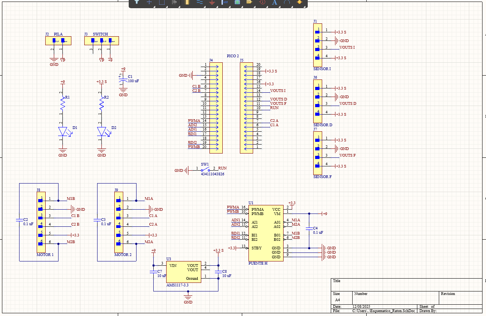

# Proyecto Final

## 1) Ratón resuelve laberintos

 El proyecto Micromouse consiste en diseñar y programar un robot móvil autónomo capaz de explorar un laberinto, construir un mapa y ejecutar una carrera rápida (fast run) desde el inicio hasta el objetivo en el centro.

**Código**

```C++

#include <stdio.h>
#include <stdlib.h>
#include <math.h>
#include "pico/stdlib.h"
#include "hardware/pwm.h"
#include "hardware/adc.h"
#include "hardware/irq.h"
 
#define LED_PIN 25
 
 
// 1. DATOS LAB
 
float PASOS_POR_CM = 44.5;
float PASOS_GIRO_90 = 110.0;
float TAMANO_CELDA_CM = 16.0;
 
//PINES
#define SENSOR_L_PIN 27
#define ADC_CH_L 1      
#define SENSOR_F_PIN 26
#define ADC_CH_F 0      
#define SENSOR_R_PIN 28
#define ADC_CH_R 2
 
#define AIN1 12
#define AIN2 11
#define PWMA 10
#define BIN1 14
#define BIN2 13
#define PWMB 15
#define ENC_L_C1 20
#define ENC_R_C1 4
 
#define ANCHO_LABERINTO 12  
#define MAX_DIST 255        
 
//VARIABLES GLOBALES
int x_actual = 0;
int y_actual = 0; // Empezamos en la esquina (0,0)
int orientacion = 0; // 0:Norte, 1:Este, 2:Sur, 3:Oeste
 
// Mapas
int mapa_distancias[ANCHO_LABERINTO][ANCHO_LABERINTO];
int paredes_norte[ANCHO_LABERINTO][ANCHO_LABERINTO];
int paredes_este[ANCHO_LABERINTO][ANCHO_LABERINTO];
int celdas_visitadas[ANCHO_LABERINTO][ANCHO_LABERINTO];
 
// Variables Motor/PID
volatile long steps_left = 0;
volatile long steps_right = 0;
float Kp = 2, Kd = 5.0, error_anterior = 0;
int velocidad_base = 15;
const float CONVERSION_FACTOR = 3.3f / (1 << 12);
 
//HARDWARE
void init_sensors() { adc_init(); adc_gpio_init(SENSOR_L_PIN); adc_gpio_init(SENSOR_F_PIN); adc_gpio_init(SENSOR_R_PIN); }
 
 
float get_distance_cm(int adc_channel) {
    adc_select_input(adc_channel);
   
    float suma_voltaje = 0;
    int muestras = 5; // Promedio para el sensor
 
    for(int i=0; i<muestras; i++) {
        uint16_t raw_value = adc_read();
        suma_voltaje += raw_value * CONVERSION_FACTOR;
        sleep_us(200);
    }
 
    float voltaje_promedio = suma_voltaje / muestras;
 
    // Transformación voltaje -> distancia (cm)
    float distance = 60.6f - (25.4f * voltaje_promedio);
   
    // Rango del sensor
    if (distance < 0) distance = 50.0;
    if (distance > 50.0) distance = 50.0;
 
    return distance;
}
 
void gpio_callback(uint gpio, uint32_t events) { if(gpio==ENC_L_C1) steps_left++; else steps_right++; }
 
void init_motors() {
    gpio_init(AIN1); gpio_set_dir(AIN1, GPIO_OUT); gpio_init(AIN2); gpio_set_dir(AIN2, GPIO_OUT);
    gpio_init(BIN1); gpio_set_dir(BIN1, GPIO_OUT); gpio_init(BIN2); gpio_set_dir(BIN2, GPIO_OUT);
    gpio_set_function(PWMA, GPIO_FUNC_PWM); gpio_set_function(PWMB, GPIO_FUNC_PWM);
    pwm_set_wrap(pwm_gpio_to_slice_num(PWMA), 12500); pwm_set_enabled(pwm_gpio_to_slice_num(PWMA), true);
    pwm_set_wrap(pwm_gpio_to_slice_num(PWMB), 12500); pwm_set_enabled(pwm_gpio_to_slice_num(PWMB), true);
    gpio_init(ENC_L_C1); gpio_set_dir(ENC_L_C1, GPIO_IN); gpio_pull_up(ENC_L_C1);
    gpio_init(ENC_R_C1); gpio_set_dir(ENC_R_C1, GPIO_IN); gpio_pull_up(ENC_R_C1);
    gpio_set_irq_enabled_with_callback(ENC_L_C1, GPIO_IRQ_EDGE_RISE, true, &gpio_callback);
    gpio_set_irq_enabled(ENC_R_C1, GPIO_IRQ_EDGE_RISE, true);
}
 
void set_speed_pwm(uint pin, int s) { if(s>100)s=100; if(s<0)s=0; pwm_set_chan_level(pwm_gpio_to_slice_num(pin), pwm_gpio_to_channel(pin), (s*12500)/100); }
 
void motor_control(int l, int r) {
    if(l>=0){gpio_put(AIN1,0);gpio_put(AIN2,1);set_speed_pwm(PWMA,l);}else{gpio_put(AIN1,1);gpio_put(AIN2,0);set_speed_pwm(PWMA,abs(l));}
    if(r>=0){gpio_put(BIN1,0);gpio_put(BIN2,1);set_speed_pwm(PWMB,r);}else{gpio_put(BIN1,1);gpio_put(BIN2,0);set_speed_pwm(PWMB,abs(r));}
}
 
void parar(){motor_control(0,0); sleep_ms(200);}
void reset_encoders(){steps_left=0; steps_right=0;}
 
//Movimientos
 
void alinear_con_frente() {
    float dF = get_distance_cm(ADC_CH_F);
    float DISTANCIA_CENTRO_PARED = 4.0;
 
    // Si estamos muy lejos, no intentamos alinear
    if (dF > 15.0) return;
   
    // tiempo para corregir
    unsigned long tiempo_inicio = to_ms_since_boot(get_absolute_time());
   
    while (true) {
        dF = get_distance_cm(ADC_CH_F);
        float error = dF - DISTANCIA_CENTRO_PARED;
 
        // Si el error es muy pequeño no hace nada
        if (fabs(error) < 0.3) break;
 
        // tiempo para corregir
        if (to_ms_since_boot(get_absolute_time()) - tiempo_inicio > 1000) break;
 
        // Velocidad de correcion
        int velocidad_ajuste = 25;
       
        if (error > 0) {
            // Si el error es mayor a 0 se acerca
            motor_control(velocidad_ajuste, velocidad_ajuste);
        } else {
            // Se aleja por el error negativo
            motor_control(-velocidad_ajuste, -velocidad_ajuste);
        }
        sleep_ms(10);
    }
    parar();
   
    //resetear encoders
    reset_encoders();
}
 
void avanzar_celda() {
    reset_encoders();
   
    // Corregir cuando va demasiado rápido y que no se derrape
    float descuento_inercia = 0;
    if (velocidad_base > 30) {
        descuento_inercia = 1;
    }
   
    long pasos_meta = (long)(PASOS_POR_CM * (TAMANO_CELDA_CM - descuento_inercia));
   
    // Configuración PID
    float DISTANCIA_IDEAL = 6;
    float UMBRAL_PARED = 10.0;
    float Kp_Enc = 1.5; float Kd_Enc = 5.0; float prev_diff_pasos = 0;
 
    while (true) {
        long pasos = (steps_left + steps_right) / 2;
       
        //Condicion para parar al cumplir los 16 cm
        if (pasos >= pasos_meta) {
            parar();
            break;
        }
       
 
        // checar la distancia del sensor
        float dF = get_distance_cm(ADC_CH_F);
       
        // si vamos rapido usamos 4.5, si vamos lento usamos 3.5
        float distancia_freno_sensor = (velocidad_base > 30) ? 4.5 : 3.5;
       
        if (dF < distancia_freno_sensor) {
            parar();
            // lo anterior pero aplicado
            if (velocidad_base > 30) alinear_con_frente();
            break;
        }
 
        // distancia de los sensores laterales
        float dL = get_distance_cm(ADC_CH_L);
        float dR = get_distance_cm(ADC_CH_R);
        float err = 0;
        bool usar_pid_paredes = true;
 
 
        if (dL < UMBRAL_PARED && dR < UMBRAL_PARED) { err = dL - dR; }//Caso donde tiene las dos paredes
        else if (dL < UMBRAL_PARED) { err = (dL - DISTANCIA_IDEAL); }  //Caso donde solo tiene pared izquierda
        else if (dR < UMBRAL_PARED) { err = (DISTANCIA_IDEAL - dR); } //Caso donde solo tiene pared derecha
        else {
            usar_pid_paredes = false;
            long diff_pasos = steps_left - steps_right;
            float P = diff_pasos * Kp_Enc;
            float D = (diff_pasos - prev_diff_pasos) * Kd_Enc;
            float correccion_enc = P + D;
            prev_diff_pasos = diff_pasos;
            motor_control(velocidad_base - (int)correccion_enc, velocidad_base + (int)correccion_enc);
        } //Caso cuando no hay paredes y se utilizan los encoders para ir derecho
       
        if (abs(err) < 0.5) err = 0;
 
        if (usar_pid_paredes) {
            prev_diff_pasos = 0;
            float correccion = (err * Kp) + ((err - error_anterior) * Kd);
            error_anterior = err;
            motor_control(velocidad_base - correccion, velocidad_base + correccion);
        }
        sleep_ms(10);
    }
}
 
void retroceder_celda() {
    reset_encoders();
    long pasos_meta = (long)(PASOS_POR_CM * TAMANO_CELDA_CM);
   
    float Kp_recto = 1.5; // ir derecho cuando va hacia atras
   
    int vel_back = 15;
   
    while (true) {
        // es como el set point
        long pasos = (steps_left + steps_right) / 2;
       
        // para ir de 16 en 16
        if (pasos >= pasos_meta) { parar(); break; }
       
        // calcular el error de pasos con los encoders
        long error_pasos = steps_left - steps_right;
       
        // calcular la correcion
        int correccion = (int)(error_pasos * Kp_recto);
       
        int motor_L = -vel_back + correccion; // Negativo para ir hacia atras
        int motor_R = -vel_back - correccion; // Negativo para ir hacia atras para que se vaya detras
       
        motor_control(motor_L, motor_R);
        sleep_ms(10);
    }
    parar();
    sleep_ms(100);
}
 
void girar_90(int direccion) { // 1=Der -1=Izq Para girar
    parar(); reset_encoders();
    long pasos_meta = (long)PASOS_GIRO_90;
    int vel = 30;
    while((steps_left+steps_right)/2 < pasos_meta) {
        if(direccion>0) motor_control(vel, -vel);
        else motor_control(-vel, vel);
        sleep_ms(10);
    }
    parar();
}
 
// Logica poara el Fload Fill
void init_laberinto() {
    for(int y=0; y<ANCHO_LABERINTO; y++) {
        for(int x=0; x<ANCHO_LABERINTO; x++) {
            paredes_norte[y][x] = 0; //Para el origen 0, 0
            paredes_este[y][x] = 0;
            if(y == ANCHO_LABERINTO-1) paredes_norte[y][x] = 1;
            if(x == ANCHO_LABERINTO-1) paredes_este[y][x] = 1;  
        }
    }
}
 
// Para cuando se pone en modo rapido
void flood_fill(bool modo_estricto) {
    // Inicialización del mapa de distancias
    for(int y=0; y<ANCHO_LABERINTO; y++)
        for(int x=0; x<ANCHO_LABERINTO; x++)
            mapa_distancias[y][x] = MAX_DIST;
 
    // Centro del laberinto
    mapa_distancias[5][5] = 0;
    mapa_distancias[5][6] = 0;
    mapa_distancias[6][5] = 0;
    mapa_distancias[6][6] = 0;
 
    // Para ir cambiando los valores de la matriz que en la meta es 0, 0 y a los lados va cambiando
    int cambios = 1;
    while(cambios > 0) {
        cambios = 0;
        for(int y=0; y<ANCHO_LABERINTO; y++) {
            for(int x=0; x<ANCHO_LABERINTO; x++) {
               
                // Cuando mapeas y no visitas esas celdas, lo que se hace cuando el raton esta en modo rapido se pone una pared
                if (modo_estricto && celdas_visitadas[y][x] == 0) {
                    bool es_meta = (x==5||x==6) && (y==5||y==6);
                    if (!es_meta) continue;
                }
 
                if(mapa_distancias[y][x] == MAX_DIST) continue;
 
                int dist_vecino = mapa_distancias[y][x] + 1;
 
                // IR GENERANDO LAS PAREDES
                if (y < ANCHO_LABERINTO-1 && !paredes_norte[y][x]) {
                   
                    if (!modo_estricto || celdas_visitadas[y+1][x]) {
                        if (mapa_distancias[y+1][x] > dist_vecino) {
                            mapa_distancias[y+1][x] = dist_vecino; cambios++;
                        }
                    }
                }
                // PARA IR GENERANDO LAS PAREDES
                if (x < ANCHO_LABERINTO-1 && !paredes_este[y][x]) {
                    if (!modo_estricto || celdas_visitadas[y][x+1]) {
                        if (mapa_distancias[y][x+1] > dist_vecino) {
                            mapa_distancias[y][x+1] = dist_vecino; cambios++;
                        }
                    }
                }
                if (y > 0 && !paredes_norte[y-1][x]) {
                    if (!modo_estricto || celdas_visitadas[y-1][x]) {
                        if (mapa_distancias[y-1][x] > dist_vecino) {
                            mapa_distancias[y-1][x] = dist_vecino; cambios++;
                        }
                    }
                }
                //PARA IR GENERANDO LAS PAREDES
                if (x > 0 && !paredes_este[y][x-1]) {
                    if (!modo_estricto || celdas_visitadas[y][x-1]) {
                        if (mapa_distancias[y][x-1] > dist_vecino) {
                            mapa_distancias[y][x-1] = dist_vecino; cambios++;
                        }
                    }
                }
            }
        }
    }
}
 
void detectar_paredes() {  // Leer sensores
    float dF = get_distance_cm(ADC_CH_F);
    float dL = get_distance_cm(ADC_CH_L);
    float dR = get_distance_cm(ADC_CH_R);
   
    // SI LA DISTANCIA ES MENOR A 12 ES 1, DE LO CONTRARIO 0
    int pared_frente = (dF < 12.0) ? 1 : 0;
    int pared_izq    = (dL < 12.0) ? 1 : 0;
    int pared_der    = (dR < 12.0) ? 1 : 0;
 
    // PARA IR GUARDANDO LAS PAREDES
 
    if (pared_frente) {
        if(orientacion==0 && y_actual<ANCHO_LABERINTO-1) paredes_norte[y_actual][x_actual] = 1;
        if(orientacion==1 && x_actual<ANCHO_LABERINTO-1) paredes_este[y_actual][x_actual]  = 1;
        if(orientacion==2 && y_actual>0)                 paredes_norte[y_actual-1][x_actual] = 1;
        if(orientacion==3 && x_actual>0)                 paredes_este[y_actual][x_actual-1]  = 1;
    }
 
    if (pared_der) {
        int od = (orientacion+1)%4;
        if(od==0 && y_actual<ANCHO_LABERINTO-1) paredes_norte[y_actual][x_actual] = 1;
        if(od==1 && x_actual<ANCHO_LABERINTO-1) paredes_este[y_actual][x_actual]  = 1;
        if(od==2 && y_actual>0)                 paredes_norte[y_actual-1][x_actual] = 1;
        if(od==3 && x_actual>0)                 paredes_este[y_actual][x_actual-1]  = 1;
    }
 
    if (pared_izq) {
        int oi = (orientacion+3)%4;
        if(oi==0 && y_actual<ANCHO_LABERINTO-1) paredes_norte[y_actual][x_actual] = 1;
        if(oi==1 && x_actual<ANCHO_LABERINTO-1) paredes_este[y_actual][x_actual]  = 1;
        if(oi==2 && y_actual>0)                 paredes_norte[y_actual-1][x_actual] = 1;
        if(oi==3 && x_actual>0)                 paredes_este[y_actual][x_actual-1]  = 1;
    }
}
 
void ejecutar_speed_run() {
   
   
    for(int i=0; i<20; i++) {
        gpio_put(LED_PIN, 1); sleep_ms(100);
        gpio_put(LED_PIN, 0); sleep_ms(900);
    }
   
    for(int i=0; i<10; i++) { gpio_put(LED_PIN, 1); sleep_ms(50); gpio_put(LED_PIN, 0); sleep_ms(50); }
 
    // VOLVER A PONER EL RATON EN EL ORIGEN
    x_actual = 0;
    y_actual = 0;
    orientacion = 0;
   
    //VELOCIDAD CUANDO VA RAPIDO
    velocidad_base = 50;
    flood_fill(true); // que haga el camino que ya se guardo
 
    // checar si la ruta esta bien guardada
    if (mapa_distancias[0][0] >= 255) {
        init_laberinto();
        flood_fill(false);
    }
 
    // ir moviendose
    while(true) {
        if(mapa_distancias[y_actual][x_actual] == 0) {
            parar();
            while(true) { gpio_put(LED_PIN, 1); sleep_ms(100); gpio_put(LED_PIN, 0); sleep_ms(100); }
        }
     
        float dF = get_distance_cm(ADC_CH_F);
               
        if (dF < 12.0) {
            alinear_con_frente();            
        }
 
        int d_actual = mapa_distancias[y_actual][x_actual];
        int mejor_orientacion = -1;
        int menor_distancia = d_actual;
 
        if(y_actual<ANCHO_LABERINTO-1 && !paredes_norte[y_actual][x_actual])
            if(mapa_distancias[y_actual+1][x_actual] < menor_distancia) {
                menor_distancia = mapa_distancias[y_actual+1][x_actual]; mejor_orientacion = 0;
            }
        if(x_actual<ANCHO_LABERINTO-1 && !paredes_este[y_actual][x_actual])
            if(mapa_distancias[y_actual][x_actual+1] < menor_distancia) {
                menor_distancia = mapa_distancias[y_actual][x_actual+1]; mejor_orientacion = 1;
            }
 
        if(y_actual>0 && !paredes_norte[y_actual-1][x_actual])
            if(mapa_distancias[y_actual-1][x_actual] < menor_distancia) {
                menor_distancia = mapa_distancias[y_actual-1][x_actual]; mejor_orientacion = 2;
            }
 
        if(x_actual>0 && !paredes_este[y_actual][x_actual-1])
            if(mapa_distancias[y_actual][x_actual-1] < menor_distancia) {
                menor_distancia = mapa_distancias[y_actual][x_actual-1]; mejor_orientacion = 3;
            }
 
        if(mejor_orientacion == -1) {
            parar();  
            break;
        }
 
        // girar
        int diff = mejor_orientacion - orientacion;
        if(diff == 1 || diff == -3) { girar_90(1); orientacion = (orientacion + 1) % 4; }
        else if(diff == -1 || diff == 3) { girar_90(-1); orientacion = (orientacion + 3) % 4; }
       
        avanzar_celda();
 
        //ir cambiando las coordenadas
        if(orientacion == 0) y_actual++;
        else if(orientacion == 1) x_actual++;
        else if(orientacion == 2) y_actual--;
        else if(orientacion == 3) x_actual--;
 
        sleep_ms(20);
    }
}
 
 
int main() {
    stdio_init_all();
   
    gpio_init(LED_PIN);
    gpio_set_dir(LED_PIN, GPIO_OUT);
 
    init_sensors();
    init_motors();
    init_laberinto();
   
  celdas_visitadas[0][0] = 1;
 
    sleep_ms(5000);
   
 
while(true) {
 
        //META
          if( (x_actual == 5 || x_actual == 6) && (y_actual == 5 || y_actual == 6) ) {
            parar();
           
            for(int i=0; i<5; i++) { gpio_put(LED_PIN,1); sleep_ms(100); gpio_put(LED_PIN,0); sleep_ms(100); }
           
            //PARA EJECUTAR EL SPEED RUN
            ejecutar_speed_run();
            break;
        }
 
        celdas_visitadas[y_actual][x_actual] = 1;
       
        detectar_paredes();
        // Detectar si hay una pared justo enfrente y alinear
        if (paredes_norte[y_actual][x_actual] && orientacion == 0) alinear_con_frente();
        if (paredes_este[y_actual][x_actual]  && orientacion == 1) alinear_con_frente();
        if (paredes_norte[y_actual-1][x_actual] && orientacion == 2) alinear_con_frente(); // Pared sur (norte del vecino)
        if (paredes_este[y_actual][x_actual-1]  && orientacion == 3) alinear_con_frente(); // Pared oeste
 
        flood_fill(false);
 
        //checa los sensores laterales para ver la mejor direccion hacia cual girar
        int min_dist = MAX_DIST;
        int mejor_orientacion = -1;
 
        // Checra las cuatro direcciones
        if(y_actual<ANCHO_LABERINTO-1 && !paredes_norte[y_actual][x_actual])
            if(mapa_distancias[y_actual+1][x_actual] < min_dist) { min_dist=mapa_distancias[y_actual+1][x_actual]; mejor_orientacion=0; }
       
        if(x_actual<ANCHO_LABERINTO-1 && !paredes_este[y_actual][x_actual])
            if(mapa_distancias[y_actual][x_actual+1] < min_dist) { min_dist=mapa_distancias[y_actual][x_actual+1]; mejor_orientacion=1; }
       
        if(y_actual>0 && !paredes_norte[y_actual-1][x_actual])
            if(mapa_distancias[y_actual-1][x_actual] < min_dist) { min_dist=mapa_distancias[y_actual-1][x_actual]; mejor_orientacion=2; }
       
        if(x_actual>0 && !paredes_este[y_actual][x_actual-1])
            if(mapa_distancias[y_actual][x_actual-1] < min_dist) { min_dist=mapa_distancias[y_actual][x_actual-1]; mejor_orientacion=3; }
 
 
       
        // Para cuando esta bloqueado en las 3 paredes
        if(mejor_orientacion == -1) {
             retroceder_celda();
             // Actualizar corrdenadas
             if(orientacion == 0) y_actual--;
             else if(orientacion == 1) x_actual--;
             else if(orientacion == 2) y_actual++;
             else if(orientacion == 3) x_actual++;
             continue;
        }
 
        // Para verificar el giro necesario
        int diff = mejor_orientacion - orientacion;
 
        // Donde esta encerrado por 2 paredes y debe ir hacia atras
        if(abs(diff) == 2) {
             retroceder_celda();
             // Actualizar coordenadas hacia atrás
             if(orientacion == 0) y_actual--;
             else if(orientacion == 1) x_actual--;
             else if(orientacion == 2) y_actual++;
             else if(orientacion == 3) x_actual++;
             continue;
        }
 
        // Giros izquierda o derecha
        if(diff == 1 || diff == -3) {
            girar_90(1);
            orientacion = (orientacion + 1) % 4;
        } else if(diff == -1 || diff == 3) {
            girar_90(-1);
            orientacion = (orientacion + 3) % 4;
        }
       
        // Avanzar si hay camino al fernye
        avanzar_celda();
 
        // Actualizar coordenadas
        if(orientacion == 0) y_actual++;
        else if(orientacion == 1) x_actual++;
        else if(orientacion == 2) y_actual--;
        else if(orientacion == 3) x_actual--;
 
        sleep_ms(150);
    }
    return 0;
}
 
```
**Esquematico de conexión**




**Video**

<iframe width="560" height="315" src="https://www.youtube.com/embed/8DKZtyBhpOA?si=ilvbCBArluu4Dcds" title="YouTube video player" frameborder="0" allow="accelerometer; autoplay; clipboard-write; encrypted-media; gyroscope; picture-in-picture; web-share" referrerpolicy="strict-origin-when-cross-origin" allowfullscreen></iframe>

---
