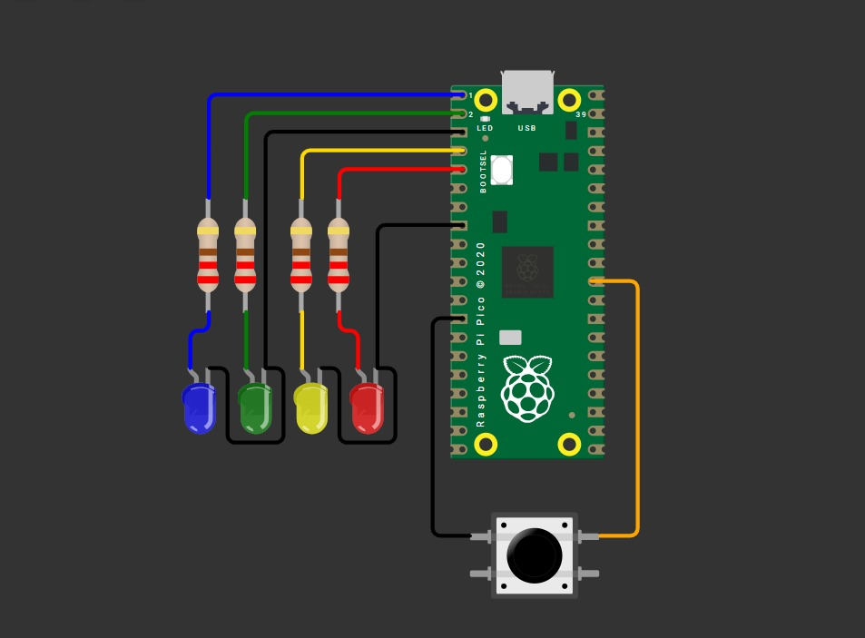

# Tarea 2

> Documenta en tu pagina los siguientes codigos usando logica y mascaras no se pueden poner todas las combinaciones:

---

## 1) Contador binario 4 bits

En cuatro leds debe mostrarse cad segundo la representacion binaria del 0 al 15.

**Código**

```C++

#include "pico/stdlib.h"
#include "hardware/structs/sio.h"
#define PIN_A 2
#define PIN_B 4
#define PIN_C 5
#define PIN_D 6

int main() {
    // 1) Máscara con varios pines
    const uint32_t MASK = (1u<<0) | (1u<<1) | (1u<<2)| (1u<<3);

    // 2) Asegura función SIO en cada pin (necesario una sola vez)
    gpio_init(0);
    gpio_init(1);
    gpio_init(2);
    gpio_init(3);
    // 3) Dirección: salida (OE=1) para TODOS los pines con UNA sola instrucción
    gpio_set_dir_out_masked(MASK);
    uint8_t contador=0;

    while (true) {

        gpio_put_masked(MASK, contador);
        sleep_ms(500);
        
        contador++;

        if (contador>=16){
            contador=0;
        }
}
}


```
**Esquematico de conexión**




**Video**

[Ver video en YouTube](https://youtube.com/shorts/V5-u_odLcfA)

---

## 2) Barrido de leds

Correr un “1” por cinco LEDs P0..P3 y regresar (0→1→2→3→2→1…)

**Código**

```C++

#include "pico/stdlib.h"
#include "hardware/structs/sio.h"

#define PIN_A 2
#define PIN_B 4
#define PIN_C 5
#define PIN_D 6

int main() {
    // 1) Máscara con varios pines
    const uint32_t MASK = (1u<<0) | (1u<<1) | (1u<<2)| (1u<<3);

    // 2) Asegura función SIO en cada pin (necesario una sola vez)
    gpio_init(0);
    gpio_init(1);
    gpio_init(2);
    gpio_init(3);
    // 3) Dirección: salida (OE=1) para TODOS los pines con UNA sola instrucción
    gpio_set_dir_out_masked(MASK);

    int pos=0;
    int mov=1;

    while (true) {

        gpio_put_masked(MASK, 1<<pos);
            // alto en 2,4,6
        sleep_ms(500);
        
        pos=pos+mov;

        if (pos==3){
            mov=-1;
        }

        else if (pos==0){
            mov=1;
        }
}
}


```


**Esquematico de conexión**


**Video**

[Ver video en YouTube](https://youtube.com/shorts/7cmU_cujRNo)


---
## 3) Secuencia en codigo Gray

**Código**

```C++
#include "pico/stdlib.h"
#include "hardware/structs/sio.h"

#define PIN_A 0
#define PIN_B 1
#define PIN_C 2
#define PIN_D 3

int main() {

    // 2) Asegura función SIO en cada pin (necesario una sola vez)
    gpio_init(0);
    gpio_init(1);
    gpio_init(2);
    gpio_init(3);
    // 3) Dirección: salida (OE=1) para TODOS los pines con UNA sola instrucción

    uint32_t cont=0;

    
    sio_hw->gpio_oe_set = (1 << PIN_A);
    sio_hw->gpio_oe_set = (1 << PIN_B);
    sio_hw->gpio_oe_set = (1 << PIN_C);
    sio_hw->gpio_oe_set = (1 << PIN_D);

    while (true) {
    
        uint32_t sec = cont ^ (cont >> 1);

        if (sec&0x1){
            gpio_put(PIN_A,1);
        }

        else{
            gpio_put(PIN_A,0);
        }
        
        if (sec&0x2){
            gpio_put(PIN_B,1);
        }

        else {
            gpio_put(PIN_B,0);
        }

        if (sec&0x4){
            gpio_put(PIN_C,1);	
        }

        else{
            gpio_put(PIN_C,0);
        }

        if (sec&0x8){
            gpio_put(PIN_D,1);		
        }

        else{
            gpio_put(PIN_D,0);
        }
        cont++;
        sleep_ms(500);

}
}

```

**Esquematico de conexión**


**Video**

[Ver video en YouTube](https://youtube.com/shorts/5_p5SqiWHKI)

