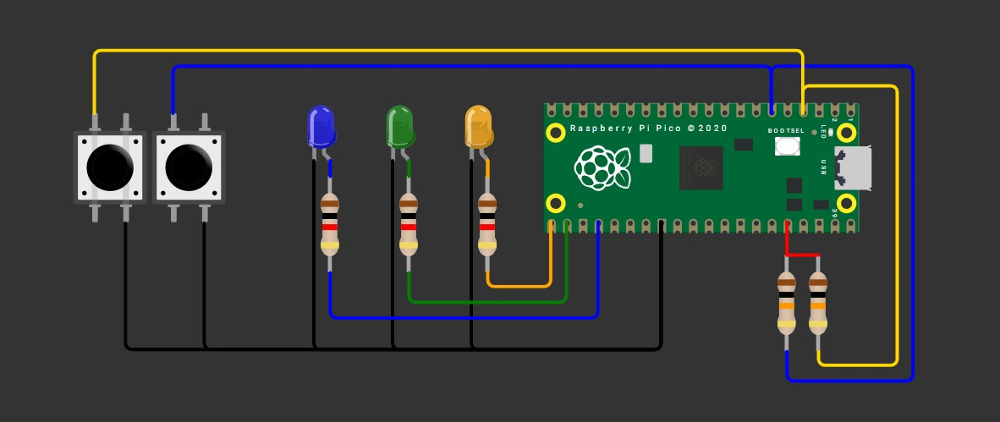
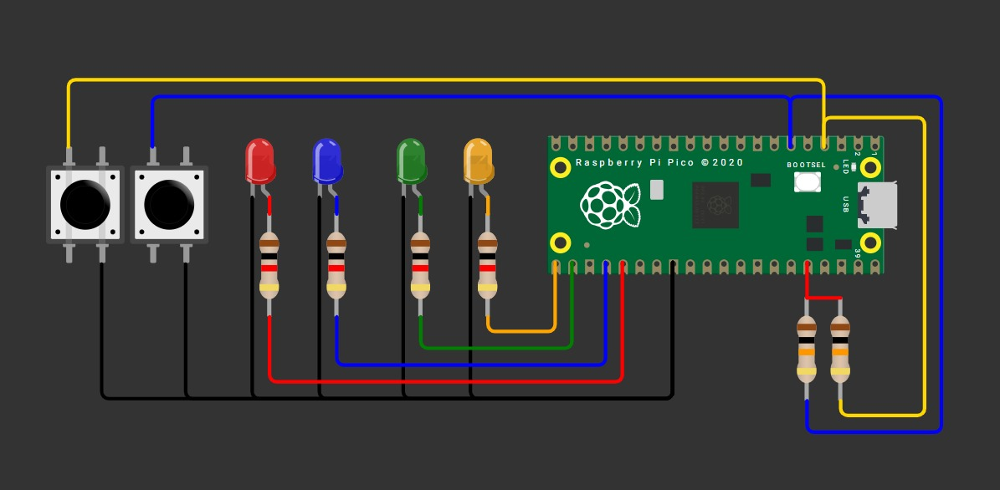

# Tarea 3

> Documenta en tu página los siguientes códigos usando lógica y máscaras

---

## 1) Compuertas básicas AND / OR / XOR con 2 botones

 Con dos botones A y B (pull-up; presionado=0) enciende tres LEDs que muestren en paralelo los resultados de AND, OR y XOR. En el video muestra las 4 combinaciones (00, 01, 10, 11).

**Código**

```C++

#include "pico/stdlib.h"
#include "hardware/structs/sio.h"
#define PIN_A 2
#define PIN_B 4
#define PIN_C 5
#define PIN_D 6

int main() {
    // 1) Máscara con varios pines
    const uint32_t MASK = (1u<<0) | (1u<<1) | (1u<<2)| (1u<<3);

    // 2) Asegura función SIO en cada pin (necesario una sola vez)
    gpio_init(0);
    gpio_init(1);
    gpio_init(2);
    gpio_init(3);
    // 3) Dirección: salida (OE=1) para TODOS los pines con UNA sola instrucción
    gpio_set_dir_out_masked(MASK);
    uint8_t contador=0;

    while (true) {

        gpio_put_masked(MASK, contador);
        sleep_ms(500);
        
        contador++;

        if (contador>=16){
            contador=0;
        }
}
}


```
**Esquematico de conexión**




**Video**

[Ver video en YouTube](https://youtube.com/shorts/V5-u_odLcfA)

---

## 2) Selector cíclico de 4 LEDs con avance/retroceso

Mantén un único LED encendido entre LED0..LED3. Un botón AVANZA (0→1→2→3→0) y otro RETROCEDE (0→3→2→1→0). Un push = un paso (antirrebote por flanco: si dejas presionado no repite). En el video demuestra en ambos sentidos.

**Código**

```C++

#include "pico/stdlib.h"
#include "hardware/structs/sio.h"

int main(void) {
    const uint LED1 = 0;
    const uint LED2 = 1; 
    const uint LED3 = 2;
    const uint LED4 = 3;       
    const uint BTN1 = 16;
    const uint BTN2 = 17; 

    const uint32_t MASK = (1u<<LED1) | (1u<<LED2) | (1u<<LED3) | (1u<<LED4);

    gpio_init_mask(MASK);
    gpio_set_dir_masked(MASK, MASK);  
    gpio_put_masked(MASK, 1u<<LED1); 

    gpio_init(BTN1);
    gpio_set_dir(BTN1,0);
    gpio_pull_up(BTN1);   
    gpio_init(BTN2);
    gpio_set_dir(BTN2,0);
    gpio_pull_up(BTN2); 

    int pos=LED1;

    while (true) {

        if (gpio_get(BTN1)==0){
            if(pos==LED4) pos=LED1;
            else 
            pos++;
            gpio_put_masked(MASK, (1u<<pos));
            sleep_ms(200);
        }

        if (gpio_get(BTN2)==0){

            if (pos==LED1)pos=LED4;
            else 
            pos--;
            gpio_put_masked(MASK, (1u<<pos));
            sleep_ms(200);
        }

    }
}

```

**Esquematico de conexión**




**Video**

[Ver video en YouTube](https://youtube.com/shorts/1cDOuaCSxCE?feature=share)


---
