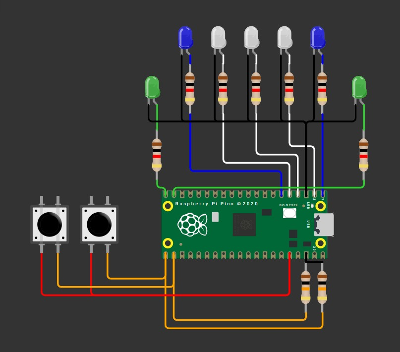

# Tarea 4

> Programar un mini-Pong con 5 LEDs en línea y 2 botones usando interrupciones (ISR) para registrar el “golpe” del jugador exactamente cuando la “pelota” (un LED encendido) llega al extremo de su lado.

---

## 1) Ping pong

# Reglas del juego

1. **Pelota**  
   Es un único LED encendido que se mueve automáticamente de un extremo al otro:  
   `L1 → L5 → L1…` a un ritmo fijo.

2. **Golpe con ISR**  
   Cada botón genera una **interrupción**:
   1. **BTN_L**: solo cuenta si, en el instante de la ISR, la pelota está en **L1**.  
   2. **BTN_R**: solo cuenta si, en el instante de la ISR, la pelota está en **L5**.  
   3. **Coincidencia**: si el botón coincide con la posición correcta de la pelota, la pelota **rebota** (invierte su dirección).  
   4. **No coincidencia**: si la pelota no está en el último LED del lado presionado, el botón se ignora.

3. **Fallo y punto**  
   1. Si la pelota alcanza **L1** y no hubo golpe válido del lado izquierdo, anota el **jugador derecho**.  
   2. Si alcanza **L5** sin golpe válido del lado derecho, anota el **jugador izquierdo**.

4. **Indicador de punto**  
   Al anotar, se parpadea el LED de punto **3 veces** del jugador que metió el punto.

5. **Reinicio tras punto**  
   Después del parpadeo, la pelota se reinicia en el **centro (L3)** y comienza a moverse hacia el **jugador que metió el punto**.

6. **Inicio del juego**  
   Al encender, la pelota inicia en **L3** y **no se mueve** hasta que se presione un botón.  
   Se moverá hacia la **dirección opuesta** del botón presionado.


**Código**

```C++

#include "pico/stdlib.h"
 
#define LED_1 0
#define LED_2 1
#define LED_3 2
#define LED_4 3
#define LED_5 4
 
#define LED_G1 14
#define LED_G2 15
 
#define Boton_1 17
#define Boton_2 16
 
int led_on = 2; //led con el que comienza el juego
int direc = 0; //para la direccion +1 izquierda, -1 derecha, negativo porque al comenzar el juego comenzamos a la izquierda
 
// 0 es no presionado, 1 es presionado
int boton_d = 0;
int boton_i = 0;
 
 

 
//esto pasa cuando alguno de los botones se presiono
void juan_perez(uint gpio, uint32_t events){
    if (gpio == Boton_1) boton_d = 1; //para ver cual de los dos botones se presiono si es el boton1, se le asigna 1 al boton derecho
    if (gpio == Boton_2) boton_i = 1;
}
 
int main() {
 
    // Poner los leds como salida
    gpio_init(0); gpio_set_dir(0, 1);
    gpio_init(1); gpio_set_dir(1, 1);
    gpio_init(2); gpio_set_dir(2, 1);
    gpio_init(3); gpio_set_dir(3, 1);
    gpio_init(4); gpio_set_dir(4, 1);
 
 
    // Salida
    gpio_init(LED_G1); gpio_set_dir(LED_G1,1);
    gpio_init(LED_G2); gpio_set_dir(LED_G2,1);
 
    // Entrada
    gpio_init(Boton_1); gpio_set_dir(Boton_1,0);
    gpio_init(Boton_2); gpio_set_dir(Boton_2,0);
 
    // GPIO_IRQ_EDGE_RISE significa que se activa la interrupcion cuando el boton se presiona y true es para activar la interrupcion
    gpio_set_irq_enabled_with_callback(Boton_1, GPIO_IRQ_EDGE_RISE, true, &juan_perez);
    gpio_set_irq_enabled_with_callback(Boton_2, GPIO_IRQ_EDGE_RISE, true, &juan_perez);
 
    while (direc == 0) { // mientras que no se haya presionado ningun boton, el led de en medio esta encendido
      gpio_put(LED_3, 1);
      if (boton_d) {      //cuando el boton derecho se presiona la variable direc es 1, por lo que la pelota va a la izquierda        
          direc = 1;   
          boton_d = 0;
      }
      if (boton_i) {
          direc = -1;  //cuando el boton derecho se presiona la variable direc es -1, por lo que la pelota va a la derecha
          boton_i = 0; //resetear la variable para que no siga detectando que el boton esta presionado 
      }
      sleep_ms(10); 
    }
 
    while (true) {
        // Apagar los leds para que no se queden encendidos siempre
        for (int i = LED_1; i <= LED_5; i++) gpio_put(i, 0);
 
        // Encender el led actual
        gpio_put(led_on, 1);
        sleep_ms(500);
 
       
        if (led_on == 0){   //si el led que esta encendido es el 0, quiere decir que la pelota llego al final izquierdo
            if(boton_d){  // si se presiona el boton se cambia la direccion de la pelota a la izquierda
                direc = 1;
            } else {
                gpio_put(LED_G2, 1);  // Si no se presiono, el jugador perdio y enciende el led del jugador 2
                sleep_ms(500);
                gpio_put(LED_G2, 0);
                sleep_ms(500);
                gpio_put(LED_G2, 1);  
                sleep_ms(500);
                gpio_put(LED_G2, 0);
                sleep_ms(500);
                gpio_put(LED_G2, 1);  
                sleep_ms(500);
                gpio_put(LED_G2, 0);
                led_on = 1;
                direc = 1; // ahora la pelota va a la izquierda
                
            }
            boton_d = 0;  // Resetear la variable del boton derecho
        }
        else if (led_on == 4) {
            if(boton_i){
                direc = -1;
            } else {
                gpio_put(LED_G1, 1);  
                sleep_ms(500);
                gpio_put(LED_G1, 0);
                sleep_ms(500);
                gpio_put(LED_G1, 1);  
                sleep_ms(500);
                gpio_put(LED_G1, 0);
                sleep_ms(500);
                gpio_put(LED_G1, 1);  
                sleep_ms(500);
                gpio_put(LED_G1, 0);
                led_on = 3;
                direc = -1;
                 
            }
            boton_i = 0;  
        }
 
        // Actualizar el led actual
        led_on += direc;
    }
}

```
**Esquematico de conexión**




**Video**

<iframe width="560" height="315" src="https://www.youtube.com/embed/4fPDO2PUujk?si=8YOV_0s4Jcjccc1J" title="YouTube video player" frameborder="0" allow="accelerometer; autoplay; clipboard-write; encrypted-media; gyroscope; picture-in-picture; web-share" referrerpolicy="strict-origin-when-cross-origin" allowfullscreen></iframe>

---

