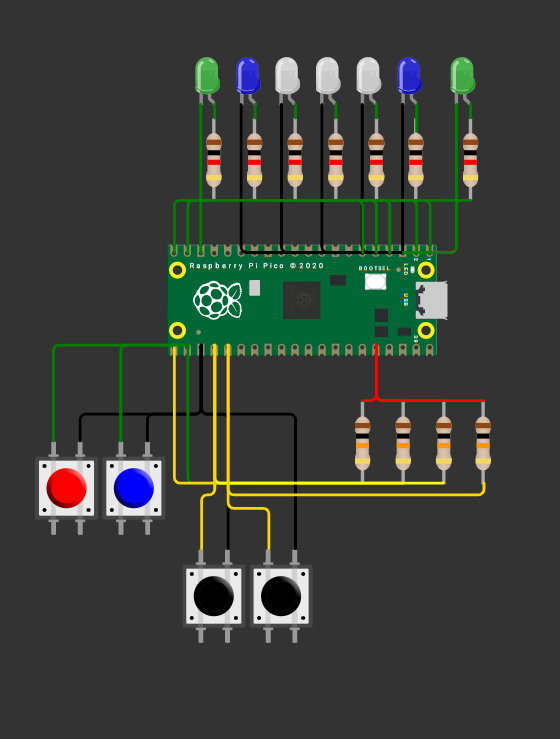

# Tarea 6
---

## 1) Cuatro alarmas / cuatro LEDs a distintas frecuencias

Configurar ALARM0..ALARM3 del timer de sistema en modo µs. Cada alarma controla un LED distinto con un periodo propio. 

Se intento activar la cuarta alarma “ALARMA3” pero en ningún momento esta alarma funciono, por lo cual solo se implementaron 3 alarmas. 

**Código**

```C++


#include "pico/stdlib.h"
#include "hardware/irq.h"
#include "hardware/structs/timer.h"
#include "hardware/gpio.h"

#define LED0_PIN     0   // LED integrado
#define LED1_PIN     1      
#define LED2_PIN     2           // LED externo en GPIO 0

#define ALARM0_NUM   0
#define ALARM1_NUM   1
#define ALARM2_NUM   2

#define ALARM0_IRQ   timer_hardware_alarm_get_irq_num(timer_hw, ALARM0_NUM)
#define ALARM1_IRQ   timer_hardware_alarm_get_irq_num(timer_hw, ALARM1_NUM)
#define ALARM2_IRQ   timer_hardware_alarm_get_irq_num(timer_hw, ALARM2_NUM)


// Próximos "deadlines" (32 bits bajos en µs) y sus intervalos en µs
static volatile uint32_t next0_us, next1_us , next2_us;
static const uint32_t INTERVALO0_US = 250000u;
static const uint32_t INTERVALO1_US = 400000u;
static const uint32_t INTERVALO2_US = 800000u;

// ISR para ALARM0
static void on_alarm0_irq(void) {
    hw_clear_bits(&timer_hw->intr, 1u << ALARM0_NUM);
    sio_hw->gpio_togl = 1u << LED0_PIN;
    next0_us += INTERVALO0_US;
    timer_hw->alarm[ALARM0_NUM] = next0_us;
}

// ISR para ALARM1
static void on_alarm1_irq(void) {
    hw_clear_bits(&timer_hw->intr, 1u << ALARM1_NUM);
    sio_hw->gpio_togl = 1u << LED1_PIN;
    next1_us += INTERVALO1_US;
    timer_hw->alarm[ALARM1_NUM] = next1_us;
}

// ISR para ALARM2
static void on_alarm2_irq(void) {
    hw_clear_bits(&timer_hw->intr, 1u << ALARM2_NUM);
    sio_hw->gpio_togl = 1u << LED2_PIN;
    next2_us += INTERVALO2_US;
    timer_hw->alarm[ALARM2_NUM] = next2_us;
}

int main() {

    gpio_init(LED0_PIN);
    gpio_set_dir(LED0_PIN, GPIO_OUT);
    gpio_put(LED0_PIN, 0);

    gpio_init(LED1_PIN);
    gpio_set_dir(LED1_PIN, GPIO_OUT);
    gpio_put(LED1_PIN, 0);

    gpio_init(LED2_PIN);
    gpio_set_dir(LED2_PIN, GPIO_OUT);
    gpio_put(LED2_PIN, 0);

    // Timer de sistema en microsegundos (por defecto source = 0)
    timer_hw->source = 0u;

    uint32_t now_us = timer_hw->timerawl;

    // Primeros deadlines
    next0_us = now_us + INTERVALO0_US;
    next1_us = now_us + INTERVALO1_US;
    next2_us = now_us + INTERVALO2_US;

    // Programa ambas alarmas
    timer_hw->alarm[ALARM0_NUM] = next0_us;
    timer_hw->alarm[ALARM1_NUM] = next1_us;
    timer_hw->alarm[ALARM2_NUM] = next2_us;

    // Limpia flags pendientes antes de habilitar
    hw_clear_bits(&timer_hw->intr, (1u << ALARM0_NUM) | (1u << ALARM1_NUM) | (1u << ALARM2_NUM));

    // Registra handlers exclusivos para cada alarma
    irq_set_exclusive_handler(ALARM0_IRQ, on_alarm0_irq);
    irq_set_exclusive_handler(ALARM1_IRQ, on_alarm1_irq);
    irq_set_exclusive_handler(ALARM2_IRQ, on_alarm2_irq);

    // Habilita fuentes de interrupción en el periférico TIMER
    hw_set_bits(&timer_hw->inte, (1u << ALARM0_NUM) | (1u << ALARM1_NUM) | (1u << ALARM2_NUM));

    // Habilita ambas IRQ en el NVIC
    irq_set_enabled(ALARM0_IRQ, true);
    irq_set_enabled(ALARM1_IRQ, true);
    irq_set_enabled(ALARM2_IRQ, true);

    // Bucle principal: todo el parpadeo ocurre en las ISRs
    while (true) {
        tight_loop_contents();
    }
}


```
**Esquematico de conexión**


**Video**

<iframe width="560" height="315" src="https://www.youtube.com/embed/o9nGzVQcT0g?si=8YOV_0s4Jcjccc1J" title="YouTube video player" frameborder="0" allow="accelerometer; autoplay; clipboard-write; encrypted-media; gyroscope; picture-in-picture; web-share" referrerpolicy="strict-origin-when-cross-origin" allowfullscreen></iframe>

---

## 2) Modificación del Ping Pong

Modificar su pong, para tener dos botones adicionales, que suban y bajen la velocidad del juego sin delay.

**Código**

```C++

#include "pico/stdlib.h"
#include "hardware/structs/sio.h"
#include "pico/time.h"
 
#define LED_1 0
#define LED_2 1
#define LED_3 2
#define LED_4 3
#define LED_5 4
 
#define LED_G1 14
#define LED_G2 15
 
#define Boton_Len 19
#define Boton_Rap 18
 
#define Boton_1 17
#define Boton_2 16
 
int led_on = 2; // led con el que comienza el juego
int direc = 0; //para la direccion +1 izquierda, -1 derecha, negativo porque al comenzar el juego comenzamos a la izquierda

 
// 0 = no presionado, 1 = presionado
int boton_d = 0;
int boton_i = 0;
 
volatile int velocidad = 450; // variables de velocidad
const int velocidad_min = 150;
const int velocidad_max = 1050;
const int cambio = 150;

repeating_timer_t timer; // Crear el temporizador

// Funcion del juego
bool Juego_Ping_Pong(repeating_timer_t *t);


//esto pasa cuando alguno de los botones se presiono
void juan_perez(uint gpio, uint32_t events){
    if (gpio == Boton_1) boton_d = 1;
    if (gpio == Boton_2) boton_i = 1;

    if (gpio == Boton_Rap && velocidad < velocidad_max) {
        velocidad += cambio;
        cancel_repeating_timer(&timer);// Cancelar el temporizador actual
        add_repeating_timer_ms(velocidad, Juego_Ping_Pong, NULL, &timer);//la nueva velocidad, que se pasa a la funcion Juego_Ping_Pong, NULL es un puntero que no se usa y &timer es el temporizador que se va a usar
    }
    if (gpio == Boton_Len && velocidad > velocidad_min) {
        velocidad -= cambio;
        cancel_repeating_timer(&timer); 
        add_repeating_timer_ms(velocidad, Juego_Ping_Pong, NULL, &timer);
    }
}
 
// Funcion del juego
bool Juego_Ping_Pong(repeating_timer_t *t) {
    // Apagar los LEDs
    for (int i = LED_1; i <= LED_5; i++) gpio_put(i, 0);

    // Encender el LED actual
    gpio_put(led_on, 1);

    // Si llega a un extremo
    if (led_on == 0){ 
        if(boton_d){  
            direc = 1;
        } else {
            // Parpadeo del jugador que pierde
            for (int i=0;i<3;i++){
                gpio_put(LED_G2, 1); sleep_ms(500);
                gpio_put(LED_G2, 0); sleep_ms(500);
            }
            led_on = 1;
            direc = 1;
        }
        boton_d = 0;
    }
    else if (led_on == 4) {
        if(boton_i){
            direc = -1;
        } else {
            // Parpadeo del jugador que pierde
            for (int i=0;i<3;i++){
                gpio_put(LED_G1, 1); sleep_ms(500);
                gpio_put(LED_G1, 0); sleep_ms(500);
            }
            led_on = 3;
            direc = -1;
        }
        boton_i = 0;  
    }

    // Avanzar la luz
    led_on += direc;
    return true; // seguir repitiendo
}
 
int main() {

    // Poner los leds como salida
    for (int i=0;i<=4;i++){ gpio_init(i); gpio_set_dir(i, 1); }
    gpio_init(LED_G1); gpio_set_dir(LED_G1,1);
    gpio_init(LED_G2); gpio_set_dir(LED_G2,1);
 
    // Botones entrada
    gpio_init(Boton_1); gpio_set_dir(Boton_1,0);
    gpio_init(Boton_2); gpio_set_dir(Boton_2,0);
    gpio_init(Boton_Len); gpio_set_dir(Boton_Len,0);
    gpio_init(Boton_Rap); gpio_set_dir(Boton_Rap,0);

 
    // GPIO_IRQ_EDGE_RISE significa que se activa la interrupcion cuando el boton se presiona y true es para activar la interrupcion
    gpio_set_irq_enabled_with_callback(Boton_1, GPIO_IRQ_EDGE_RISE, true, &juan_perez);
    gpio_set_irq_enabled_with_callback(Boton_2, GPIO_IRQ_EDGE_RISE, true, &juan_perez);
    gpio_set_irq_enabled_with_callback(Boton_Len, GPIO_IRQ_EDGE_RISE, true, &juan_perez);
    gpio_set_irq_enabled_with_callback(Boton_Rap, GPIO_IRQ_EDGE_RISE, true, &juan_perez);

 
    // Inicio del juego
    while (direc == 0) {
        gpio_put(LED_3, 1);
        if (boton_d) {        
            direc = 1;  
            boton_d = 0;
        }
        if (boton_i) {
            direc = -1;  
            boton_i = 0;
        }
        sleep_ms(10);
    }
 
    // Inicia el timer con la velocidad inicial
    add_repeating_timer_ms(velocidad, Juego_Ping_Pong, NULL, &timer);
 
    while (true) {
        tight_loop_contents(); // Mantiene el programa corriendo
    }
}


```


**Esquematico de conexión**




**Video**

<iframe width="560" height="315" src="https://www.youtube.com/embed/GCX5c34Ttzk?si=8YOV_0s4Jcjccc1J" title="YouTube video player" frameborder="0" allow="accelerometer; autoplay; clipboard-write; encrypted-media; gyroscope; picture-in-picture; web-share" referrerpolicy="strict-origin-when-cross-origin" allowfullscreen></iframe>

---
