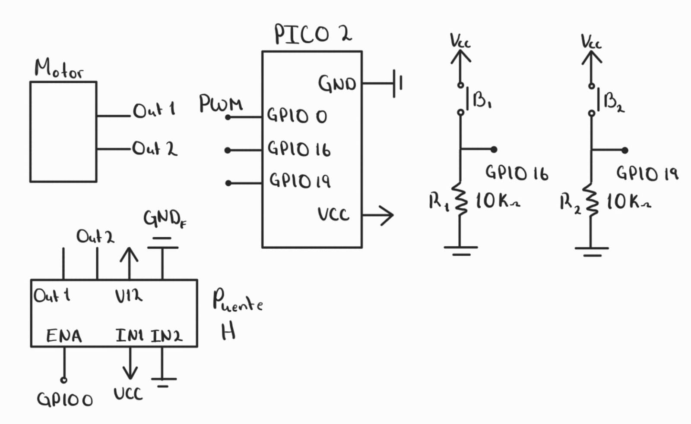

# Tarea 7.1 PWM
---

## 1) Control de Duty Cycle — Motor DC


- Implementar un circuito con un motor DC controlado mediante PWM variando el duty cycle.
- Usar 2 botones para seleccionar entre 3 velocidades predefinidas (baja, media y alta).
- Documentar:
    * Valores de duty usados, con el porque.
    * Circuito
    * Código


!!! note "Nota"
    No olvidar que el microcontrolador no entrega suficiente potencia, se debe usar un puente H o driver de motor para conectar el motor DC.


**Valores de duty usados**

Velocidad Baja: 250  porque lo que entra en el motor son 12 volts y lo que minimo con lo que se puede alimentar el motor es 3 volts, esto es el 25, por lo tanto el duty cicle mínimo es el 25%, lo cual es 250.
Velocidad Media:512
Velocidad Alta:1023  porque es lo máximo. 


**Código**

```C++

#include "pico/stdlib.h"
#include "hardware/pwm.h"


#define BOTON1 16
#define BOTON2 19
#define MOTOR 0
#define F_PWM_HZ 2000   // 2 kHz: fuera del rango visible
#define TOP 1023        // 10 bits de resolución

int BOTON1ESTADO=0;
int BOTON2ESTADO=0;


int main() {
    stdio_init_all();

    gpio_set_function(MOTOR, GPIO_FUNC_PWM);
    uint slice = pwm_gpio_to_slice_num(MOTOR);
    uint chan  = pwm_gpio_to_channel(MOTOR);

    // Calcular divisor
    float f_clk = 150000000.0f; // 125 MHz
    float div = f_clk / (F_PWM_HZ * (TOP + 1));
    pwm_set_clkdiv(slice, div);
    pwm_set_wrap(slice, TOP);

    pwm_set_chan_level(slice, chan, 1023);
    pwm_set_enabled(slice, true);


    gpio_init(BOTON1); gpio_set_dir(BOTON1,0);
    gpio_init(BOTON2); gpio_set_dir(BOTON2,0);

    int velocidades[3]={250,512,1023};
    int velocidad_actual=0;

    while (true) {
        BOTON1ESTADO=gpio_get(BOTON1);
        BOTON2ESTADO=gpio_get(BOTON2);

        if (BOTON1ESTADO==1){
            velocidad_actual++;
            if (velocidad_actual>2){
                velocidad_actual=0;
            }
            pwm_set_chan_level(slice, chan, velocidades[velocidad_actual]);
            sleep_ms(300);
        }

        if (BOTON2ESTADO==1){
            velocidad_actual--;
            if (velocidad_actual<0){
                velocidad_actual=2;
            }
            pwm_set_chan_level(slice, chan, velocidades[velocidad_actual]);
            sleep_ms(300);
        }

        sleep_ms(10);


    }
}


```
**Esquematico de conexión**




**Video**

<iframe width="560" height="315" src="https://www.youtube.com/embed/v5QQKKRf06g?si=8YOV_0s4Jcjccc1J" title="YouTube video player" frameborder="0" allow="accelerometer; autoplay; clipboard-write; encrypted-media; gyroscope; picture-in-picture; web-share" referrerpolicy="strict-origin-when-cross-origin" allowfullscreen></iframe>


---

