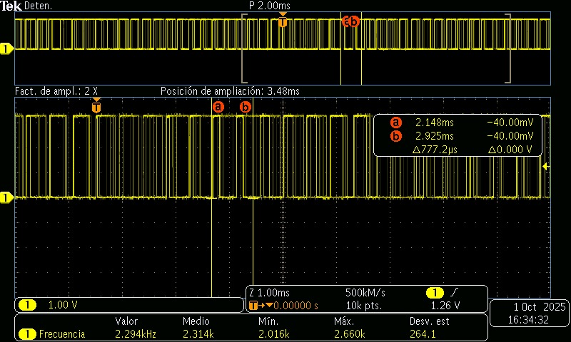
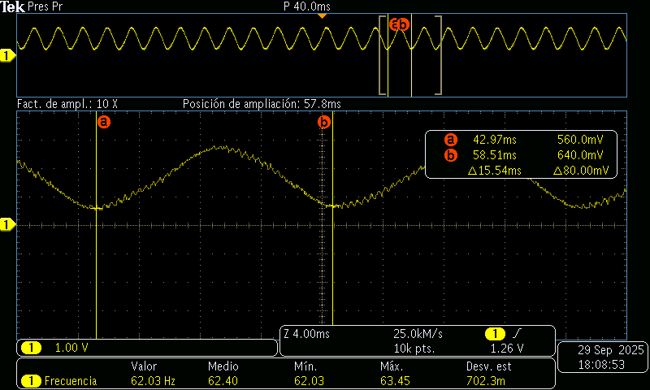

# Tarea 7.3 PWM
---

## 1) Generación de Señales — Senoidal de 60 Hz con PWM + Filtro RC


- Entregable
Generar una señal sinusoidal aproximada de 60 Hz variando el duty cycle del PWM según una función seno.

Construir un filtro RC pasabajos básico y verificar la señal en el osciloscopio:

* Capturas de osciloscopio Antes del filtro (PWM) y Después del filtro.
    

- Explicación de la frecuencia de corte:

El filtro RC se diseña para dejar pasar señales de 60 Hz y eliminar las componentes de alta frecuencia que provienen del PWM.

La frecuencia de corte (fcf_cfc​) es el punto donde el filtro empieza a atenuar las señales.
 
Matemáticamente:

En este caso, queremos que fc sea un poco mayor que 60 Hz para que nuestra señal sinusoidal de 60 Hz no sea atenuada.

Valores recomendados para un fc≈100Hz

Opción 1: R=2.2 kΩR C=0.68 μF fc≈106Hz.

Opción 2: R=1.6 kΩR, C=1 μF  fc≈100Hz


Conexion:

1.  La salida de PWM entra en la resistencia.

2. Después de la resistencia, conectar el capacitor a tierra.

3. El punto entre resistencia y capacitor es la salida filtrada, que se conecta al osciloscopio.


**Código**

```C++

// pwm_led.c — Atenuar LED con PWM en GPIO 2
#include "pico/stdlib.h"
#include "hardware/pwm.h"
#include <math.h>

#define LED_PIN 0
#define F_PWM_HZ 100   // 2 kHz: fuera del rango visible
#define TOP 255        // 10 bits de resolución

int main() {
    stdio_init_all();

    gpio_set_function(LED_PIN, GPIO_FUNC_PWM);
    uint slice = pwm_gpio_to_slice_num(LED_PIN);
    uint chan  = pwm_gpio_to_channel(LED_PIN);

    // Calcular divisor
    float f_clk = 125000000.0f; // 125 MHz
    float div = f_clk / (F_PWM_HZ * (TOP + 1));
    pwm_set_clkdiv(slice, div);
    pwm_set_wrap(slice, TOP);

    pwm_set_chan_level(slice, chan, 0);
    pwm_set_enabled(slice, true);

    // Fade
    int level = 0, step = 35, dir = +step;
    

    while (true) {
        pwm_set_chan_level(slice, chan, level);

        level += dir * step;
        if (level >= TOP) {
            level = TOP;
            dir = -1;
        } else if (level <= 0) {
            level = 0;
            dir = 1;
        }

        sleep_ms(1);
    }
}


```
**Captura**

SIN FILTRO




CON FILTRO




---