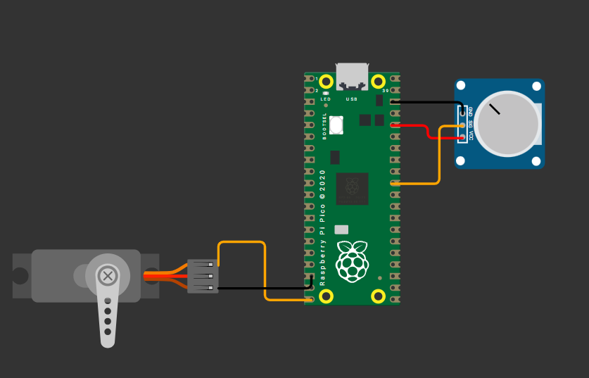

# Tarea 9.2

---

## 1) Servo con ADC


El potenciómetro funcionará como un control manual que permitirá variar la posición del servomotor de manera proporcional.

El valor analógico leído por el ADC (convertidor analógico-digital) del Arduino será mapeado a un rango de 0 a 180 grados, haciendo que el eje del servo se mueva suavemente conforme se gira el potenciómetro.


**Código**

```C++

#include <stdio.h>
#include "pico/stdlib.h"
#include "hardware/adc.h"
#include "hardware/pwm.h"

#define ADC_INPUT 0 
#define SERVO_PIN 15 // 2 kHz: fuera del rango visible
#define TOP 1023
uint slice_num; 

void configurar_servo() {
    // Configura el pin como salida PWM
    gpio_set_function(SERVO_PIN, GPIO_FUNC_PWM);

    // Obtiene el número de slice PWM asignado al pin
    slice_num = pwm_gpio_to_slice_num(SERVO_PIN);

    // Divisor de clock para ticks de 1µs (125MHz/125 = 1MHz)
    pwm_set_clkdiv(slice_num, 125.0f);

    // Configura periodo de 20ms (20000µs) para frecuencia de 50Hz
    pwm_set_wrap(slice_num, 20000);

    // Habilita la salida PWM
    pwm_set_enabled(slice_num, true);

}


void mover_servo(int adc) {
    // Limita el valor del ADC al rango válido
    if (adc < 0) adc = 0;           // No permitir valores negativos
    if (adc > 4095) adc = 4095;     // No permitir valores mayores a 4095
    
    int angulo = (adc * 180) / 4095;
    
    // Convierte ángulo a ancho de pulso:
    // - Mínimo: 500µs (0 grados)
    // - Máximo: 2500µs (180 grados)
    int pulso_us = 500 + (angulo * 2000) / 180;

    // Aplica el ancho de pulso al PWM
    pwm_set_gpio_level(SERVO_PIN, pulso_us);

    // Muestra el ángulo actual por consola
    printf("Servo en %d°\n", angulo);
    }


int main() {
    stdio_init_all();
    adc_init();
    adc_gpio_init(26); 
    adc_select_input(ADC_INPUT);

    configurar_servo();

    while (true) {
        uint16_t adc = adc_read();
        int angulo = (adc * 180) / 4095;
        printf("%u\n", adc);
        mover_servo(adc);
        sleep_ms(10);
    }
}


```
**Esquematico de conexión**




**Video**

<iframe width="560" height="315" src="https://www.youtube.com/embed/8hLURUSWa2w?si=8YOV_0s4Jcjccc1J" title="YouTube video player" frameborder="0" allow="accelerometer; autoplay; clipboard-write; encrypted-media; gyroscope; picture-in-picture; web-share" referrerpolicy="strict-origin-when-cross-origin" allowfullscreen></iframe>

---
